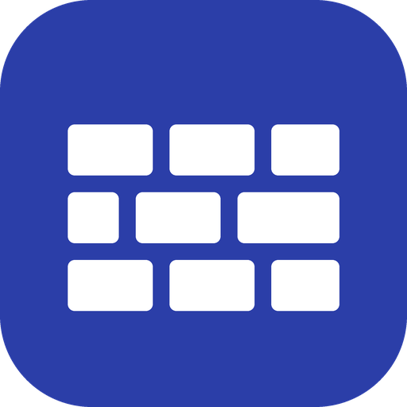
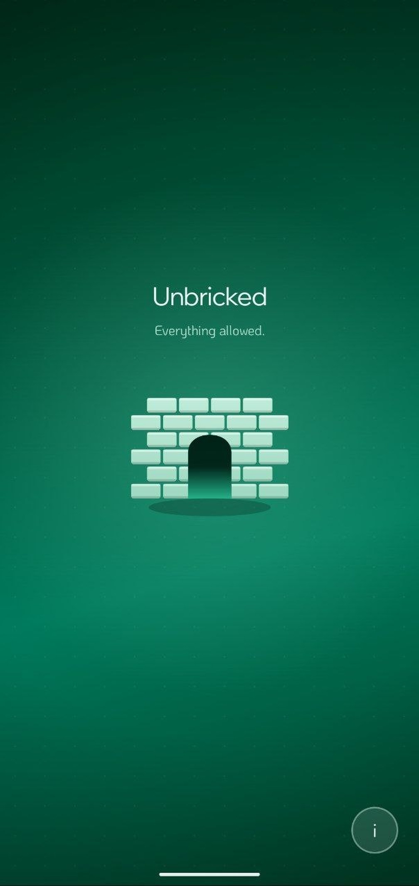
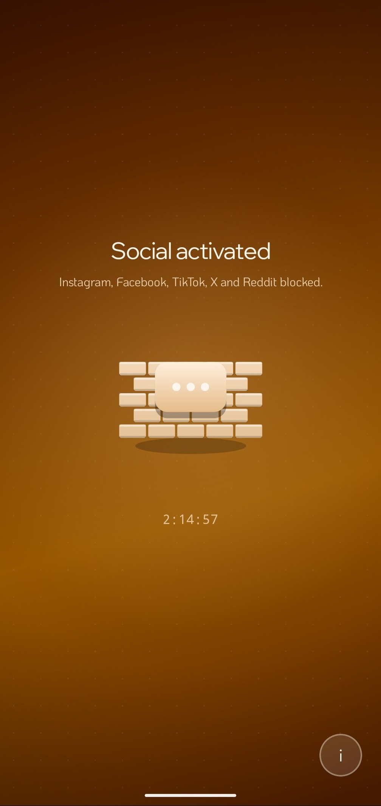
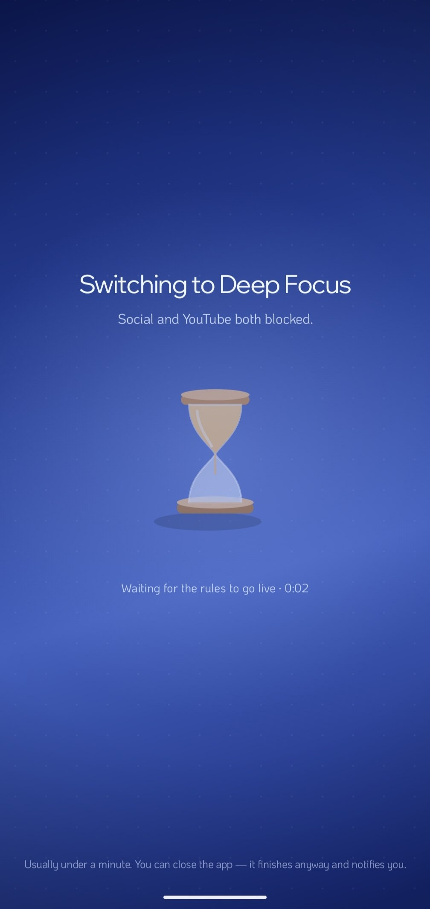
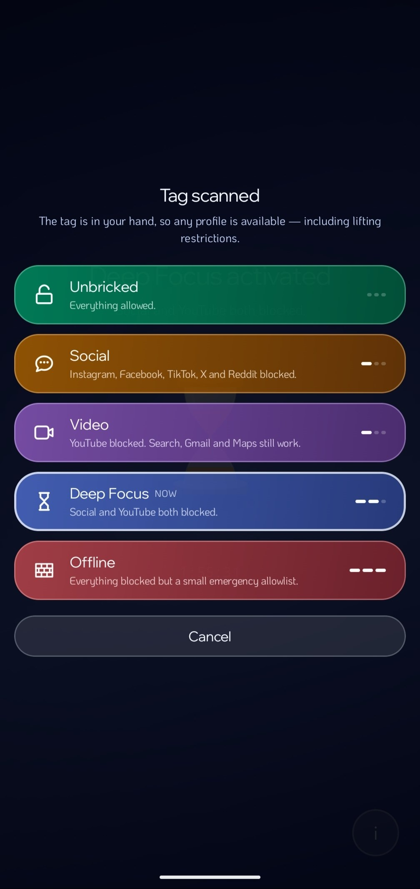

<p align="center">
  
</p>

<h1 align="center">Briq</h1>

Briq is a cross-device focus-blocker that blocks categories of the internet for your own devices. It runs on
a Pi and comes with an Android app that changes profiles with one tap on an NFC tag.

**Core features:**
- Cross-device blocking of apps and websites via DNS-blocking
- Brick once, all devices are affected
- Different profiles for different brick levels (can be easily customized)
- Scheduling of regular bricks (e.g. mornings on weekdays, every sunday at 10am, etc.)
- NFC tag as "Briq", to lift restrictions
- NFC tags also supported for other actions (e.g. having a tag close at workstation to switch to "deep-focus")
- Nice looking android app, to make it feel like an actual product
- Escalating bricks always works, lifting restrictions needs tag/QR code
- Optional Tailscale support, to also work away from home

<div align="center">
<table>
<tr>
<td></td>
<td></td>
<td></td>
<td></td>
</tr>
</table>
</div>

---

## Profiles

One of five is active at a time. The Pi is the single source of truth; every
client is a remote control.

| Profile | Level | Effect on your devices |
|---|---|---|
| `unbricked` | 0 | Everything allowed. |
| `social` | 1 | Instagram, Facebook, TikTok, X, Reddit blocked. |
| `video` | 1 | YouTube blocked. Search, Gmail, Maps unaffected. |
| `deep-focus` | 2 | Social and YouTube both blocked. |
| `offline` | 3 | Everything blocked but a small emergency allowlist. |

Profiles are plain text files listing domains. Adapting needs no code change
and no app release.

## How it works

The Pi runs [AdGuard Home](https://adguardhome.org/) as the household DNS
resolver. A small Python controller rewrites *only* the region of AdGuard's
user rules between two marker comments, leaving every other rule, filter list
and setting byte for byte intact.

Every rule it writes carries AdGuard's `$client=` modifier, so a profile
applies **only** to devices you explicitly registered. Everyone else in the
house is untouched by every profile, including `offline`.

> **Briq is not an ad blocker.** AdGuard Home is here as the DNS engine Briq
> steers; its blocklist feature is a separate thing you may switch on or leave
> off, and Briq behaves identically either way. If you do enable blocklists,
> they are AdGuard's own and apply to your whole household independently of
> which profile is active..

```
  NFC tag / QR code / app / web page / schedule
                    |
                    v
        briq-controller  (Python, stdlib only, port 8088)
                    |  rewrites the BRIQ MANAGED block
                    v
            AdGuard Home  (DNS for all devices)
                    |  $client= scoped rules
                    v
              your devices
```

Applying a profile takes **20–30 seconds** (at least on my old Pi 1st gen).
The controller blocks until it has verified the rules are live in
the filtering engine rather than returning early and lying. That waiting state
is reflected in the app and it sends a notification when a profile successfully switched.

## What is in this repo

| Path | What |
|---|---|
| `pi/` | The controller, the profile engine, the scheduler, the systemd unit, the nftables template |
| `android/` | Briq, the Android client (Kotlin + Jetpack Compose) |
| `docs/` | Setup, operations, and the product/design rationale |

## Getting started

1. **[docs/SETUP.md](docs/SETUP.md)** — the Pi, AdGuard Home, the controller,
   your router, and registering your devices. Start here; nothing else works
   until this is done.
2. **[docs/ANDROID.md](docs/ANDROID.md)** — configure and build the app.
3. **[docs/TAGS.md](docs/TAGS.md)** — print the QR sheet, write the NFC tags.
4. **[docs/TAILSCALE.md](docs/TAILSCALE.md)** — optional: keep the brick
   working away from home.
5. **[docs/OPERATIONS.md](docs/OPERATIONS.md)** — daily use, editing domain
   lists, rotating the token, troubleshooting, and how to undo all of it.

## Known limitations

Read these before building anything.

- **DNS blocking is not a firewall.** Apps still open. Cached content still
  plays. Hard-coded IP addresses still connect. Instagram app for example seems to persist quite long even after DNS block (which is why I included instructions and support for iOS shortcuts, to also block app access).
- **Any DNS bypass defeats it.** A VPN, Android Private DNS, iCloud Private-relay or a browser
  using its own DNS-over-HTTPS goes straight past the Pi. Turn those off on
  the bricked devices, or none of this applies to them.
- **The QR sheet and `select`/`toggle` NFC tags are credentials.** Anyone on
  your LAN who photographs the sheet can lift your brick.
- **The Pi becomes a single point of failure for household DNS** once you
  point the router at it. Write the rollback down somewhere that does not
  need the internet.
- **It is friction, not enforcement.** Someone determined to get around it
  will get around it.

## Status, and where this came from

This is a project I created for myself to improve my work focus. I was looking into existing commercial
and FOSS solutions found nothing that met all my expected criteria (especially cross-device sync).
I share it on GitHub to offer something to people, who also were dissatisfied
with existing solutions and are looking for alternatives. 

**It is not actively maintained.** There is no roadmap, no support, and no
promise that issues or pull requests get a reply. I may update things, but
only when I personally need it. I will try to review PRs once in a while though,
so that contribution is possible.

**Much of the code and documentation was written by AI coding agents**, including
most of this README. I believe it to be the norm these days, but if you're
reluctant to AI-based project, that's your disclaimer right here.

Expect to adapt it. The router steps differ on each device, the profiles block
what I needed, and the app is sideloaded and Android only.

## License

Briq's source code is licensed under the [GNU GPL v3](LICENSE). The bundled
Android fonts retain their separate [SIL Open Font License 1.1](FONT-LICENSES.md).
